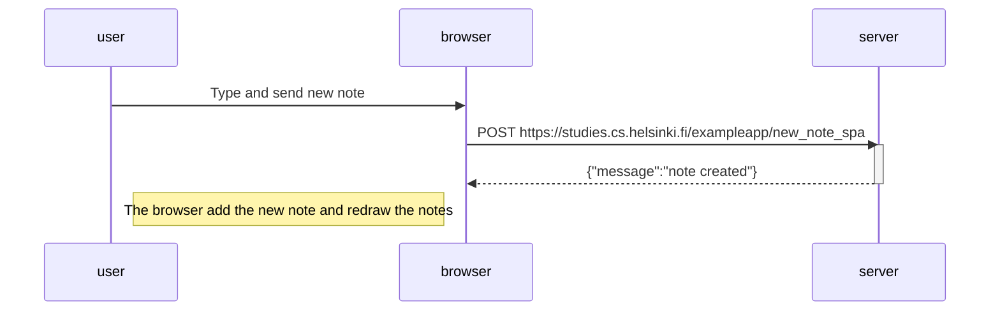

```mermaid
sequenceDiagram
participant user
participant browser
participant server

    user->>browser: Type and send new note
    browser->>server: POST https://studies.cs.helsinki.fi/exampleapp/new_note_spa
    activate server
    server-->>browser: {"message":"note created"}
    deactivate server

    Note right of user: The browser add the new note and redraw the notes

```
